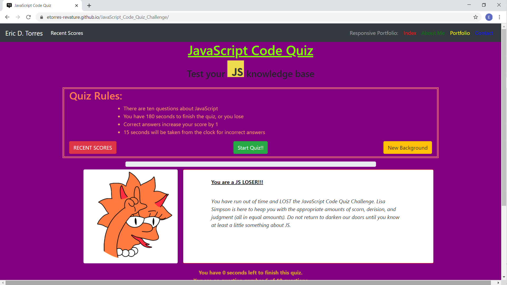

# :school: *JavaScript_Code_Quiz_Challenge* :school:

The world wide web is composed of three primary languages:  Hypertext Markup Lanauge **(HTML)**; Cascading Style Sheets **(CSS)** and JavaScript **(JS)**.

Each perfroms a specific funciton: 

1. *HTML* is used to structure and present content on the World Wide Web;
2. *CSS* is the language for describing the presentation of web pages (i.e. - fonts, layout, colors, etc) as well, it allows for the presentation to adapt to different types of devices with different size screens;
3. _JavaScript_ is used to implement complex features on web pages by
    * displaying timely content
    * creating interactrive features
    * animated graphics
    * dynamically created properties
    * setting timers/intervals
    * specials effects in games
    * and many other prominent aspects of world wide web interactivity.

In order to test your **JS** knowledge, I have created the [*JavaScript Code Quiz Challenge*](https://etorres-revature.github.io/JavaScript_Code_Quiz_Challenge/).  It is powered by **JS** with ten questions ranging from beginner to intermediate difficulty. While you are deterimining your level of **JS** knowledge, you will also be getting an indication of the sorts of capabilities that **JS** can bring to a web page.

## :video_game: GAMEPLAY :video_game:
     
[**JavaScript Code Quiz Challenge**](https://etorres-revature.github.io/JavaScript_Code_Quiz_Challenge/)

When the link above is clicked you will be taken to the web page containig the *JavaScript Code Quiz Challenge*.  The NavBar will take you to the Recent Scores page and there are links to my [***Responsive Portfolio***](https://etorres-revature.github.io/Responsive_Portfolio/) on the far right.  The quiz rules are displayed in the middle of the screen.

If the default background does not suit your tastes, then I have provided a ***"New Background"*** button that uses **JS** to change the **CSS** setting for the *background color*.

When you click on the button that reads ***"Start Quiz!!"*** **JS** is used to display the elements of the game:

* *an image*
* *an area to display the question*
* *four buttons each with a potential correct answer*

While you are taking the *JavaScript Code Quiz Challenge* **JS** is being used to manipulate the following **HTML** elements:

1. Dynamic display of the *Progress Bar* informing you of the percentage time left in the game;
1. Providing a running *counter* of the second left to finish the game;
1. Displaying the *number of questions* that have been *answered*; and 
1. Keeping a *tally of correct answers* (e.g. - you're ***SCORE!!***).

Once you have answered all of the questions, the image and message will be changed by **JS** based on the *percentage of questions* that you have *answwered correctly*.

Don't let the timer run out; otherwise, a *devil-may-care* **Lisa Simpson** will ***devilishly*** appear to inform you that you have lost!!

When you are finished with the *JavaScript Code Quiz Challenge*, **JS** is used to store an array of objects containing player initials and scores.  When the ***Top Scores*** page is visited **JS** is used to dynamically dispaly information of the last ten players and their associated scores.  ***JSON parse/stringify*** is used to store this array of objects in *Local Storage*, so that the information is ***persisted*** that is it will be available in the browser even if it is closed or reloaded (the information will be lost once the user or another application **clears** *Local Storage*).

And there you have it, just a small taste of the ways in which **JS** can make your web pages both *dynamic* and *interactive* ***!!!***

### :computer: Technologies Used :computer:

#### :memo: HTML5 :memo:

**HTML 5** is a markup language used for structuring and presenting content on the World Wide Web.  The goals are to improve the language with support for the latest multimedia and other new features; to keep the language both easily readable by humans and consistnetly understood by computers and devices; and to remain backward compatible to older software.  Many new symantic features are included.

**HTML5** content borrowed from <a target="_blank" rel="noopener noreferrer">[this page](https://en.wikipedia.org/wiki/HTML5).</a>

#### :art: CSS :art:

**Cascading Style Sheets (CSS)** is a stylesheet language used for describing the presentation of a document written in a markup language (such as HTML5).  CSS is designed to enable the separation of presentation and content; including layout, colors, and fonts.  This separation improves content accessibility to provide more flexibility and control in the specificatio nof presntation characteristics, enabling multiple web pages to share formatting by specifying relevant CSS in a separate file, which redduces complexity and repetitioin in the structural content (HTML) as well as enabling the file to be cached to improve the page load speed between the pages that share the file and its formatting.

Separation of formating and content also makes it feasible to present the same markup page in different styles for differnt rendering methods, such as on-screen, in print, by voice, and on Braille-based tactivle devices. 

CSS content borrowed from <a target="_blank" rel="noopener noreferrer">[this page](https://en.wikipedia.org/wiki/Cascading_Style_Sheets).</a>

#### :shoe: Bootstrap 4 :shoe:

**Bootstrtap 4** is a free and open-source CSS framework directed at responsive, mobile-first front-end web development.  It contains CSS and (optionally) JavaScript-based design templates for typography, forms, buttons, navigation, and other interface components.  

Bootstrap 4 content borrowed from <a target="_blank" rel="noopener noreferrer">[this page](https://en.wikipedia.org/wiki/Bootstrap_(front-end_framework)).</a>

#### :sparkler: JavaScript :sparkler:

**JavaScript (JS)** is one of the core technologies of the World Wide Web (along with HTML and CSS). It ienables interactive web pages and is an essential part of web applications.  JS is a multi-faceted, scripting language that provides versatility through Application Programming Interfaces (APIs) and Documetn Object Model (DOM) manipulation, among others.

JavaScript content borrowed from <a target="_blank" rel="noopener noreferrer">[this page](https://en.wikipedia.org/wiki/JavaScript).</a>

## Author :sunglasses:

Content and design created by :green_heart: Eric D. Torres :green_heart:.  

The author can be reached at etorresnotary@gmail.com. 

###### License

This product is unlicensed.